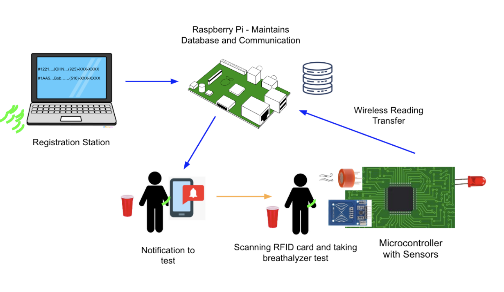
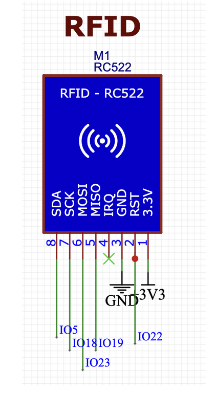
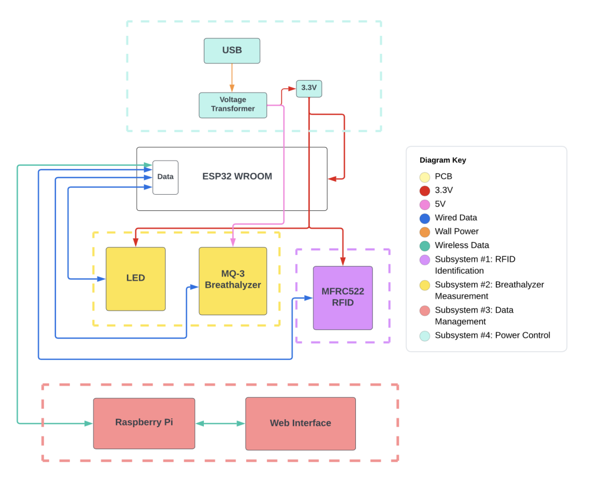

# Date: January 29
Our group has finalized the project idea over the course of the week and we began to work on the project proposal. Our primary objective was to develop a comprehensive block diagram. We identified three main subsystems: RFID, Breathalyzer, and Data Management. We shared multiple ideas to discuss their feasibility, and evaluated their pros and cons. Each team member brought their unique ideas, potential problem-solution pairs to the table, and collaborated effectively to ensure that each subsystem complemented the others and functioned well in the overall system. We made sure everyone understood their responsibilities and duties towards each other. By the end of it, we had a skeletal structure and a somewhat finished block diagram.

# Date: February 1
We delved further into the problem and tried to identify more issues and ideas on how to tackle them. Essentially, we thought more about expanding on the implementation of our subsystems and laid out an initial game plan, including the parts we would need and how the product we are delivering would be used in practice. We discussed the project idea on a more user-friendly level. The project would include RFID-enabled wristbands/cards, a breathalyzer, a Raspberry Pi, and a microcontroller to measure the blood alcohol content (BAC) levels of users and encourage more responsible drinking.

The TipsyTracker system would remind users to get their BAC levels checked so they can be in control of their senses on a real scale analysis. The system would alert the host if a guest's BAC levels are above a certain threshold. I carried forth discussions about the real-time use cases and issues about device liquid safety, and anticipating the problems for the device in real-time such as what would we have the device do in case of system failure, and what could cause our project to either malfunction or provide mismanaged data. Privacy is also a concern that we would have to tackle since we would be handling so much data about BAC levels.

# Date: February 3
We finalized the proposal and made small edits to it in accordance with the formatting of previous semesters. I assisted with finishing up the block diagram and made the high-level requirements more suitable to the overall success of our project instead of depending on the subsystem workings. We made plans of getting final inputs from the TA and making a submission for the project proposal a day before the deadline.

# Date: February 7
We had made plans to breadboard the ordered components and were able to successfully breadboard the complete system design. This step was imperative to test the functionality of the various subsystems and identify any potential issues that needed to be resolved before proceeding with the manufacturing process. Akash made the decision to take the lead on making the PCB schematics with the incorporated parts.

Additionally, breadboarding the entire system helped the team to verify that all the components were correctly interconnected and that the system was working according to the expected standards. By utilizing the expertise of each team member, any problems encountered during testing were effectively addressed to ensure that the system operated as intended.

# Date: February 20th
We decided to work on the design document and laid out a plan on how we would use the proposal as a basis and expand on the requirements and verification of the subsystems. In the course of the discussion, we carefully reviewed the current system design, identified areas that required clarification or more development, and discussed the implementation plan. Moreover, we identified potential issues that could arise during the manufacturing process. This comprehensive review

# Date: February 27th
We conducted a successful design review presentation where my teammates and I went over our design document with the professors and some TAs. We received valuable feedback about a possible problem where our device could be provided with fake BAC values for a user when the air they blow into the breathalyzer is not generated with enough pressure so that it comes from the lungs. To tackle this issue, the professor suggested the addition of a pressure sensor, and we decided to go over the feasibility of this addition with the TA. 

# Date: March 6th 
We reviewed the componetents that arrived and delegated soldering responsibilities. I suggested three possible feature improvements including a graph to visiaualize BAC levels over time, adding an RFID Tag to the PI to avoid tediously typing a number, and redesigning the PCB to allow for larger resistors and capacitors. 

# Date: March 7th/8th:

On the 7th and 8th of March, my friend Eshrith and I decided to take on a challenging task - soldering surface-mount components. We both had some experience with soldering but never had the opportunity to work with these tiny electronic components before. In preparation for the task, we watched tutorial videos and read articles about the proper techniques and best practices. We gathered all the necessary tools, including a soldering iron, soldering wire, tweezers, and a magnifying glass to get a better view of the components.

We set up a well-ventilated workspace and started practicing on some spare surface-mount components before moving on to the actual project. As we worked, we discovered that soldering surface-mount components required a steady hand, keen eye, and a lot of patience. We spent hours practicing our technique and trying to perfect the delicate art of soldering surface-mount components. Despite encountering some difficulties, such as accidentally lifting pads and bridging solder connections, we persevered and eventually made significant progress. By the end of our two-day soldering marathon, we had successfully completed the task and gained valuable skills that would benefit us in future projects.

# Date: March 14th:

On March 14th, I participated in a meeting to discuss a design document for an innovative project we were working on. The conversation revolved around the potential limitations of our current design, focusing primarily on the integration of a pressure sensor and parallel data streams. We began by reviewing the design document, carefully examining each section and noting any areas that could be improved or modified.

During the meeting, each team member shared their thoughts and ideas, fostering a collaborative and inclusive environment. We brainstormed and exchanged ideas on how to address these issues while optimizing the overall performance of our device. Some of the ideas included researching alternative pressure sensors, reevaluating our data processing methods, and exploring the feasibility of incorporating machine learning algorithms to improve the accuracy of our system.

As the discussion progressed, we began to develop a list of action items and assigned responsibilities to each team member. The meeting concluded with a renewed sense of enthusiasm and determination to tackle the challenges that lay ahead. It was an enlightening and inspiring discussion that provided valuable insights for our project's future development.

# Date: March 20th:

On March 20th, we hosted the first of two parties designed to gather training data for our project. We invited ten friends over to participate, ensuring that they were aware of the purpose of the gathering.

We carefully planned the event to create a relaxed and enjoyable atmosphere while still adhering to our data collection objectives. We provided a variety of beverages and snacks, as well as games and activities to keep the participants engaged. Throughout the evening, we explained the importance of accurate and consistent data for the success of our project, emphasizing the role each person played in this process.

As the participants consumed alcohol, we had them blow into our Arduino-based sensor and a commercial breathalyzer at regular intervals. We took detailed notes on the readings from both devices, as well as any contextual factors that could potentially influence the results, such as the type and quantity of alcohol consumed and the duration between drinks. This allowed us to collect valuable data to refine our device and algorithms, while also gaining insights into the real-world conditions under which our device would be used.

# Date: March 21st:

During our meeting on March 21st, we delved deeper into the topic of making the pressure sensor work effectively. We began by conducting a comprehensive review of the available literature on pressure sensors and their applications. This research helped us better understand the underlying principles and technologies that govern the functioning of these sensors. Armed with this knowledge, we felt more confident in our ability to identify and address potential issues.

Several ideas were proposed during the meeting, including placing a cloth in front of the breathalyzer, creating an enclosure to detect differences in pressure, and covering the pressure sensor with paper to observe changes. We debated the merits of each proposal, considering factors such as cost, ease of implementation, and potential impact on the overall performance of our device.

We also discussed the possibility of determining if someone was breathing through the breathalyzer by analyzing the fluctuations in the MQ-3 sensor values. This led to a broader conversation about data analysis techniques, and we considered incorporating additional sensors or algorithms to enhance the accuracy of our device. The discussion was productive and led to a deeper understanding of the pressure sensor and its potential applications. By the end of the meeting, we had developed a clear plan of action for improving the performance of our pressure sensor and were eager to begin implementing the proposed solutions.

# Date: March 22nd:

Two days later, on March 22nd, we hosted a second party, this time focusing on collecting testing data. Once again, ten friends attended and drank alcohol. We used the feedback and observations from the first party to make improvements to our data collection process, ensuring a smoother and more efficient experience for everyone involved.

Just like the first party, we carefully monitored the alcohol consumption of our participants and had them blow into our Arduino sensor and a breathalyzer at regular intervals. We continued to document the readings from both devices, along with any relevant contextual information. The data gathered from this event would prove crucial in assessing the accuracy and reliability of our device. By comparing the results from both parties, we hoped to identify any patterns or discrepancies that could help us further refine our system.

# Date: March 23rd - 25th:

From March 23rd to 25th, Sumedh and Eshrith, another friend of mine, took on the task of soldering the second version of our PCB (printed circuit board). They began by reviewing the schematic and layout diagrams, making sure they understood the function and location of each component. They also took the time to research any unfamiliar components or techniques, ensuring they were well-prepared for the task at hand.

Despite their best efforts, they faced numerous challenges in achieving the precision and accuracy required to solder the intricate components of the PCB. This experience emphasized the importance of refining our soldering skills and investing in better equipment. After several attempts and numerous revisions, they finally managed to complete the PCB assembly. Their perseverance and determination were a testament to the passion and commitment shared by our entire team.

# Date: March 28th:

On the 28th of March, we had a brief meeting to discuss the difficulties encountered during our PCB soldering attempts. We shared tips and tricks, and brainstormed potential solutions to improve our soldering process. Some of the suggestions included investing in higher-quality soldering equipment, such as a soldering station with temperature control and a hot air rework station for surface-mount components. We also discussed the possibility of attending workshops or classes to further develop our soldering skills.

Although the discussion was short, it served as a reminder of the importance of communication and collaboration in overcoming obstacles and achieving our goals. By pooling our collective knowledge and experiences, we were better equipped to address the challenges that arose during the project. As we moved forward, we continued to support and learn from one another, confident in our ability to bring our innovative idea to life.

# Date: April 4

During a recent team gathering, we all agreed that developing an alternative PCB that employs the development board would be a wise course of action. This would guarantee that we have a dependable backup plan in the event that our main breathalyzer system encounters any unforeseen difficulties. This decision was made to ensure the overall success and reliability of our project, while also mitigating any risks associated with potential issues in our primary breathalyzer system.

# Date: April 8

On this day, we received the development board PCB, which was specifically designed as a backup solution for our primary breathalyzer system. Possessing this alternative PCB provides our team with a feeling of security and confidence, as it ensures that we have a viable contingency plan in the event of any problems arising with our main system. We carefully inspected the development board PCB upon its arrival and were pleased to discover that it had been fabricated accurately and without any visible defects. The board's design, component placement, and routing all seemed to be consistent with our initial plans, giving us faith in the quality and functionality of the backup solution. In the upcoming days, we will proceed with soldering the components onto the development board PCB.

# Date: April 10

Our team has successfully completed the soldering process for the development board PCB, which serves as our backup solution for the breathalyzer system. We assembled as a group, reviewed the schematic and layout diagrams, and collaboratively soldered the PCB components. We then conducted thorough testing to ensure the proper functioning of the PCB, which proved to be successful. Additionally, we initiated discussions regarding the creation of a 3D enclosure for the development board PCB.

# Date: April 15

Our team came together today to rehearse for the forthcoming mock demonstration of our breathalyzer system. This practice session allowed us to polish our presentation skills, guarantee a seamless delivery of information, and identify any areas that needed improvement before the actual demonstration. During the rehearsal, each team member took turns presenting their respective portions of the project, concentrating on clearly and concisely conveying the key attributes and advantages of our TipsyTracker system. Furthermore, we made a conscious effort to address any potential inquiries or concerns that might arise during the demonstration.

After each individual's presentation, we offered one another constructive criticism, discussing methods to improve the clarity, flow, and overall effectiveness of our presentation. This collaborative approach assisted us in fine-tuning our presentation, boosting our confidence and ensuring that we were well-prepared for the mock demonstration.

# Date: April 18

As we conducted our mock demonstration of the breathalyzer system at the ECEB, we faced an unexpected challenge - the absence of data access within the building. This constraint posed a potential issue for our presentation since we needed to showcase our system's data communication and processing capabilities. Additionally, we discovered problems with our RFID sensor, prompting us to reorder the part and resolder the system.

# Date: April 22

Our team convened today with the primary objective of recording a video demonstrating all the notification features of our breathalyzer system. We aimed to create an all-encompassing video that illustrates the complete functionality of our communication system, including sending notifications to users and hosts. This video will be displayed during the demo presentation to provide the audience with a clear understanding of how the communication system operates.

During the meeting, we made sure to set up the breathalyzer system and connect all the necessary components, ensuring that everything was working as intended. Each team member played a role in the filming process, from operating the breathalyzer system to recording the notifications on various devices.

We meticulously filmed each notification feature, showcasing the smooth communication between the breathalyzer system, the Raspberry Pi, and the users' devices. This video will not only serve as evidence of the system's full capabilities but also provide a clear understanding of how the communication system works for the audience during the demo.

# Date: April 26

Today marked a significant milestone for our team as we conducted the final demo of our TipsyTracker device. The excitement was palpable as we showcased the results of our hard work and dedication. The demonstration proceeded exceptionally well, with all subsystems functioning seamlessly together. Each team member confidently presented their respective components, highlighting the unique features and benefits of the TipsyTracker. We also provided a live demonstration of the device in action, accurately measuring BAC levels and successfully utilizing the RFID technology for guest identification.

# Date: April 27

Our team gathered today to work on our presentation in preparation for the upcoming mock presentation. This meeting was essential to ensure that we effectively communicated the key aspects of our TipsyTracker device and to fine-tune our delivery before presenting it in a more formal setting.

# Date: April 29

Today, our team made significant progress on our TipsyTracker project. After refining the presentation based on our practice sessions and team feedback, we turned our attention to the final design document, which will serve as a comprehensive record of our project's development journey.

# Date: May 1

Today was a productive day for our TipsyTracker team, as we not only polished our presentation but also completed the final design document.

We began the day by practicing our presentation, focusing on refining our delivery, timing, and transitions between sections. Each team member confidently presented their assigned portion, while the others attentively listened and provided valuable feedback. By the end of the practice session, we had significantly improved our presentation, ensuring a smooth and engaging delivery that effectively communicates the key aspects of our project.

Following the presentation practice, we focused on finalizing our design document. Each team member contributed their respective sections, meticulously reviewing and proofreading the content to guarantee accuracy and clarity. As we combined the individual sections, we ensured that the document flowed seamlessly and cohesively, providing a comprehensive overview of the TipsyTracker's development process.
