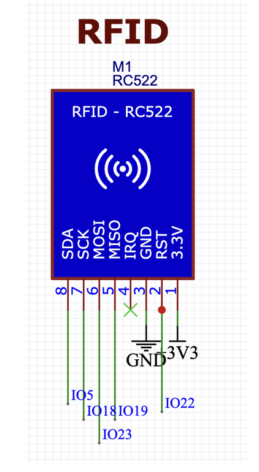

# Date Jan 29th:
At this point, a lot of the project was still in flux, and we decided to discuss out thoughts and ideas. We did some brainstorming on white boards and wrote stuff down on papers, and we all drew diagrams of what might be successful. We looked at the professors feedback to the blog post arguments to see how we could modify our project to be something more feasible for the class and something more distinguishable from previous semesters. We started to developing a high level diagram together. We identified three different systems that could go into the project. These include the RFID subsystem, the breathalyzer subsystem, and the power system. All these three subsystems would work together, to create a comprehensive final project. 

# Date Feb 1st
During the meeting we disucssed privacy issues and how we can best handle user data. One of the things we talked about was deleting data at the end of the party. We can’t have this the host being able to access all these or after all the party is over so we also talked about how we could collect data from a breathalyzer system. We also discussed how data might be sent over the net work for the raspberry pi and how the whole system plays together. Some of the preemptive issues we thought about were synchronization. Some of the other issues that we thought about include analysis of how we may use our sensor value to actually get the BAC data and we also thought about other problems including liquid damage. For example, how might it behave if water hit that the device. Do I need to create a waterproof enclosing? We are still in the early stages of the project. We need to handle a lot of different pieces of information and figure out what to do so that in real time we can make sure that data is being sent properly and it is not mismanaged. We also thought about our plans to begin a breadboard model parallely as we made our pcb. We also finalized an RFID sensor. 

# Date Feb 3rd:
Today the TA gave us except for feedback on what was wrong with the block diagram. He said that he didn’t like how different portions are highlighted and how there were a lot of weird bars around a lot of the different components. He thought that some of our subsystems were unnecessary and over complicated and gave us advice on how to change the keys so that they’re clear for the reader, and overall the visual appearance on the block diagram was too confusing and not in accordance with what he expected. He pointed us to a few resources from previous semsters so that we could better look at what the block diagram expectations were, and communicated our design to him in a clear away. After looking at these other block diagrams, we modified it and decided to remove background colors, and added dashed lines, and we also decided to make sure make sure that everything was in accordance with the rubric.

# Date Feb 7th:
All of us gathered at one apartment and opened up the bread board and all the components. We initially decided that it would be good for us to put all of the components on the bread board, working together at working design of a prototype. As we were developing a PCB we decided that we would each handle one subsystem and wire everything together while we were doing this we useed the Arduino seraeal monitor to check each sensor and see if it was working & responding as expected. We took debugging steps into account such as looking at the data sheet of manufacturer, playing with resistor values and augmenting the way in which the components were connected. Ultimately, after a few hours were able to successfully put together all the components for a project and have a working breadboard prototype of the whole project.

# Date Feb 20th
Today we all gathered together and sat down and brainstormed out how we would map out a design document, We decided to be an expert on one subsystem.  I had handled the breathalyzer system with Eshrit handled the RFID subsystem, and Akash handled the power subsystem. We thought carefully about some of the requirements that each subsystem would need and we decided to collaborate together and brainstormed a big list of requirements together. We also decided that since each of us would handle a sub system, it would be important for us to figure out how our individual subsystems would communicate with one another so that the overall final project would be functional. We thought a lot about the way that data was laid out as well. We also carefully thought about requirements and verifications for the project. I would handle a lor of the BAC data.

# Date: Feb 27th
Today we got to present our design document to the professor for feedback. After looking at our entire system he thought the project was doable, but inquired why we chose to stick to alcohol and not also use marijuana. We explained to him the alcohol sensors are more available on the market and marijuana sensors and that typically at clubs people don’t usually use marijuana, but they drink alcohol after coming to a consensus to limit the project to just alcohol. He then identified one possible problem in the project. We used an MQ3 sensor to measure alcohol but professional grade police breathalyzers, use a pressure sensor, so someone could easily cheat the system by blowing in through their nose, and out through their mouth, avoiding the pressure detection process altogether. This could be detrimental to our project because our project relies on accurately monitoring blood alcohol levels at this point we had already designed one PCB but it’s ok. We could go ahead and re-designed the PCB to incorporate a pressure sensor the same night we went home and started researching pressure sensors and thinking about how we might be able to incorporate them into our project.

# Date March 14th:
On March 14 we just started discussing the design doc and limitations. We thought about different ideas for incorporating the pressure sensor into our project. One of the biggest issues with the pressure sensors that blowing may not create a change in pressure, that’s large enough to be detected on a psi scale. Moreover, we have two different sensors being parallley collecting data. We have a breathalyzer subsystem and an RFID tag that both need to be collecting data possibly at the same time and this data also needs to be transferred wirelessly to a raspberry pie so it was really confusing to us how we might be sending data from one device to another.  Perhaps maybe one core of the Arduino could handle the sensors and the other could handle interactions with the data management system, but we’re still figuring it out at this point.

# Date: March 20th
We conducted a study were 10 people came over and consumed alcohol throughout the night. We recorded there BAC values as measured by an off the shelf, breathalyzer and compared them to the analog output, values of the MQ3 sensor we collected 40 Datapoint seen in the plot below.

# Date: March 21st
We tried multiple different approaches to try to get the pressure sensor to work initially when we connected the pressure sensor to the bread board we were not able to detect a change in psi. This is slightly problematic for us for a project so we conducted a couple of tests to try to get a change in pressure. We put a cloth in front of breathalyzer to see if doing so may allow us to detect whether or not if someone blows hot enough, the cloth would get pushed into the breathalyzer and only then alcohol would get through. We also thought about putting a piece of paper over the sensor to see if we can play with force and area and change the sensor values. We also thought maybe it might be possible to see if someone is breathing with enough pressure into the breathalyzer just by looking at data from the MQ3. The idea was that we would be able to artificially create a larger change in pressure that is detectable by the sensor and determine if someone's  air actually came from to lungs and out through their mouth, and are not trying to cheat the system.

# Date: March 22nd 
After the first observational study, we tried to map a linear relationship between the off-the-shelf breathalyzer values and the MQ3 Sensor Values. Once this linear relationship was extrapolated it, we programmed it into the Arduino, so that the output would now be a predicted BAC value. We conducted a second observational study, where we invited the same 10 people over to voluntarily consume alcohol throughout the night and recorded both their predicted, BAC values from the MP3 sensor, and their BAC values from an off-the-shelf breathalyzer. See the plot below.

# Date: March 23rd - 25th
The second PCB design arrived and Eshrit and I tried to soldier it together. One of the benefits of the second designs that there’s larger space between components and bridging is less likely. Moreover, the GPIO have been reassaigned so that the Arduino doesn’t reuse the same pins for Wi-Fi communication and the breathalyzer sensor. Finally, the PCB had some challenges of its own as we tried to soldier. There is one chip in particular U2 that had pins that were too small to be actually soldiered without bridging. In order to fix this we went to the TA who gave us a different components. We tried incorporating this component into design, but failed to do so today. 

# March 28th:
At this point there’s still some major struggles with PCB design. We are unable to get some components on to the board. We tried to use different temperatures and tried to melt the components into place with heat. We also discussed the possibility of using the oven.  We had a back up plan  with the help of a TA that involves using a different microcontroller programmer from a to program the microcontroller.

# April 4th:
Despite several times to solder the PCB, we were still unsuccessful. At this point, we needed a back up plan beyond just presenting our breadboard. In the worst case that we were not able to get this solderied and working in time, our group agreed to make a back up PCB that has enough for our micro controller and sensors, Ie a PCB that uses the Arduino as a base.

# April 10th: 
On April 10 we all met up ECEB to solder the bread board together we put the MQ3 sensor, the breathalyzer and RFID sensor onto the dev board PCB and connected all the components and ran unit test on each component to make sure they were all able to send and receive data from the microcontroller, and that our overall system would incorporate with the raspberry pi in the same way our breadboard did.

# April 18th:
Today we showed up and ECB for the mock demo, hoping to present the system that we had create.  Halfway through the presentation we noticed that our system is failing. We were not able to receive text messages in the ECEB due to poor data reception more over our device would not connect to the ECEB Wi-Fi be due to firewall issues. This was horrible for us because we had hoped to present our demo to the TA. Instead we  discussed our subsystems and integration. We discussed the rest of the presentation and got feedback about the way that we present other portions of the presentation except for the live demo.  In the end after the meeting we all decided we need to discuss a better solution to demonstrating our project.One one possible solution is moving to another room with better get a reception another possible solution is moving to a different building all together or doing the demo outside. Finally the worst  case we discussed the solution of creating a video as a back up so that we would still be able to show off the functionality of the to tracker device.

# April 22nd:
The purpose of today’s meeting was to film a video to demonstrate the functionality of the tipsy tracker device since the ECEB did not give us good reception since we were not able to find another location for the demo, and since we were not able to work with engineering IT staff to resolve firewall issues, we needed to record a video. We recorded a couple of things. One us receiving text message notifications because that wouldn’t be possible in the building,  we recorded sample test of people scanning their RFID tag and blowing into the breathalyzer sub system, and finally we recorded a video of the login portal that would be seen on the host computer for the device. After all of this, Akash meticulously, edited videos together to help our demo.

# Date April 26th:
Today was the day of our live demo. We were cut off about 15 minutes and by a communications major, who gave us some valuable feedback on the presentation. One idea she suggested that combine the discussion of each subsystem with the challenges that we faced in that subsystem instead of keeping them at separate slides. The communications major gave us written feedback on a piece of paper. She said to pay more attention when your partner speak, to avoid rocking your body from left to right while speaking to the audience, and three to speak up more and stand up straight.
