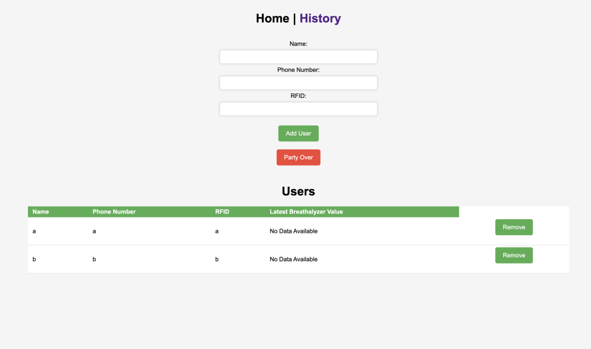

# Akash Patel Lab Notebook
# ECE 445

# Date: January 29
For the TipsyTracker Project Proposal, our group worked together closely to develop the block diagram that included the RFID subsystem, Breathalyzer measurement subsystem, and Data management subsystem. We had multiple brainstorming sessions where we shared our ideas, discussed the feasibility of different approaches, and evaluated the pros and cons of each subsystem.

We all shared our expertise and worked together to ensure that the different subsystems complemented each other and functioned effectively in the overall system. Each team member had a specific role to play, and we ensured that everyone had a clear understanding of their responsibilities.

*Snapshot of block diagram*

# Date: February 1
Our group identified the problem of irresponsible drinking, which is a common issue, especially among university students, that leads to significant negative consequences, including deaths caused by excessive alcohol consumption. Our solution, TipsyTracker, is a comprehensive system that employs RFID-enabled wristbands/cards, breathalyzer devices, a Raspberry Pi server, and an ESP32 microcontroller to measure the blood alcohol content (BAC) levels of partygoers/patrons and encourage responsible drinking habits. TipsyTracker notifies guests about their BAC levels and sends reminders to them to check their levels, as well as alerts the host if a guest's BAC level exceeds a predetermined limit.

I specifically worked on identifying two subsystems. The Breathalyzer Measurement Subsystem, which involves the MQ-3 sensor, is responsible for measuring the BAC levels of partygoers/patrons by using a breathalyzer device. It is connected to the ESP32 microcontroller and communicates with the RFID identification subsystem to ensure that the test results are associated with the correct partygoer/patron. The Data Management Subsystem, powered by the Raspberry Pi server, is responsible for handling the communication between the device and the registration station and sending notifications to partygoers/patrons and the host. It hosts the necessary software and databases, handles data storage, analysis, and management, and sends reminders to partygoers/patrons at set intervals to test their BAC levels and notifies the host if necessary.

By working together as a group and collaborating effectively, we were able to develop a comprehensive solution that addresses the issue of excessive alcohol consumption and encourages responsible drinking habits. The TipsyTracker system is an effective solution to promote awareness and responsibility among partygoers and patrons.

# Date: February 3
During the development of the TipsyTracker project proposal, I assisted the group by editing and refining the document to ensure that it was clear, concise, and well-organized. I worked closely with the team members to ensure that the document was coherent and that the language used was appropriate for the intended audience.

In addition to editing the proposal, I also drew a visual aid to help illustrate the system architecture and explain how the different subsystems interacted with each other. The visual aid helped to clarify the system design and made it easier for team members to understand the overall concept of the TipsyTracker system.

*Snapshot of visual aid*

# Date: February 7

On February 7th, the TipsyTracker development team made significant progress by successfully breadboarding the entire system design. This was a crucial step in the development process as it enabled us to test the functionality of the different subsystems and identify any potential issues that needed to be addressed before moving forward with the manufacturing process.

Breadboarding the entire system also allowed the team to ensure that all components were properly connected and that the system was functioning as expected. By leveraging the expertise of each team member, we were able to address any issues that arose during testing and ensure that the system was operating as intended.

*Breadboard of our project*

# Date: February 13
I am pleased to report that during the development of the TipsyTracker system, I was able to make significant progress on the Printed Circuit Board (PCB) schematic. Specifically, I was able to complete the first schematic for the PCB, which included important components such as the power input, 5V to 3.3V regulator, USB-to-UART converter, MQ-3 sensor, RFID sensors, and other key parts.

The power input section of the schematic was critical to ensure that the device was able to operate properly and that there were no issues with power delivery. The 5V to 3.3V regulator was important to provide the correct voltage for the components, and the USB-to-UART converter enabled the device to communicate with the Raspberry Pi server.

The MQ-3 sensor and RFID sensors were also critical components that allowed the system to measure BAC levels and identify partygoers/patrons accurately. Other parts, such as capacitors and resistors, were included to ensure proper signal conditioning and noise reduction.

Overall, the completion of the first schematic for the PCB was a significant milestone in the development of the TipsyTracker system. By leveraging my skills in PCB design and component selection, I was able to ensure that the system was well-designed and capable of meeting the requirements of the project.

*PCB schematic*

# Date: February 15
I was able to make significant progress on the Printed Circuit Board (PCB) modeling and connections. Specifically, I was able to complete the modeling and line drawing of the PCB, which was a critical step in the development of the device.

The modeling and connections of the PCB were important because they enabled the team to visualize the physical layout of the device and ensure that all components fit correctly. I was able to create a detailed model of the PCB and ensure that all components were properly placed.

I helped to identify any potential issues or conflicts with the design, allowing the team to make any necessary adjustments before moving forward with the manufacturing process. This ensured that the device would function properly and meet the requirements of the project.

Overall, the completion of the first version of the PCB was a significant milestone in the development of the TipsyTracker system.

*Original PCB connections*

# Date: February 20
On February 20th, we started a discussion on the design document for the TipsyTracker system. This was an important step in the development process as it allowed us to ensure that all team members were on the same page regarding the system design and implementation.

During the discussion, we reviewed the current system design and identified any areas that needed clarification or further development. We also discussed the implementation plan and identified any potential issues that could arise during the manufacturing process. Through this discussion, we were able to identify areas of improvement and ensure that the system design was well-documented and understood by all team members.

# Date: February 21
We worked on refining the design document for the system. Specifically, we focused on adding more information about the requirements and verifications for all subsystems in the system, and I worked on adding a new power subsystem to the design.

I took the lead on adding detailed information about the functionality of each subsystem and the tests that would be used to verify that the subsystem was operating as intended (R and V).

By adding this additional information to the design document, we were able to ensure that all team members had a clear understanding of the requirements for each subsystem and the expected performance of the system as a whole. This allowed us to identify any potential issues or areas of improvement and make the necessary adjustments to ensure that the system would meet the requirements of the project.

# Date: February 24
I made significant progress in the development of the TipsyTracker system by ordering all the components needed for the PCB. This was a critical step in the manufacturing process, as it ensured that we had all the necessary parts to build the device.

To ensure that all the components were of high quality and met the requirements of the project, I carefully researched and selected each part. This involved evaluating different vendors and comparing prices to ensure that we were getting the best value for our money.

Once I had selected the components, I placed the order and worked closely with the team to ensure that the parts were delivered on time and in good condition. 

# Date: March 2

I successfully wrote the Arduino code for the MQ-3 and RFID sensors. This was a crucial step in the development process as it allowed us to test the functionality of the sensors and ensure that they were operating as intended.

The Arduino code that I wrote included logic for reading data from the MQ-3 and RFID sensors and processing the data for use in the TipsyTracker system. Additionally, I incorporated functionality for sending POST requests to a simple webserver that I wrote in Python. This feature enabled the system to send data to the webserver for storage and analysis, and allowed us to monitor the performance of the sensors in real-time.

The successful implementation of the Arduino code for the MQ-3 and RFID sensors, with the added functionality of sending post requests to a webserver, was a significant accomplishment in the TipsyTracker development process. My contribution to this milestone helped to move the project forward, and we are now one step closer to achieving our goal of creating an effective and reliable system for monitoring alcohol consumption.

*Compilation of arduino code*

# Date: March 5

I revamped the Python code to incorporate a web portal that allows for adding entries, viewing user history, and sending text messages about the BAC levels using Twilio. This was a crucial step in the development process as it allowed us to test the functionality of the web portal and ensure that it was operating as intended.

The revamped Python code includes a user-friendly web interface that allows hosts to add new entries and monitor the BAC levels of party-goers in real-time. The code also includes Twilio integration, allowing the system to send text messages to party-goers about their BAC levels and reminding them to check their levels at regular intervals.

Additionally, the code includes functionality for storing user history (during the party) to help hosts identify trends in alcohol consumption and make informed decisions about future events.

The successful implementation of the revamped Python code was a significant accomplishment in the TipsyTracker development process. By incorporating a user-friendly web portal and Twilio integration, the system is now more effective and easier to use than ever before. 

*Version 1 of Web Portal*

# Date: March 6
We discussed the plan for soldering the PCB, as well as went over my Arduino and Python code. This was an important step in the development process as it allowed us to prepare for the manufacturing phase and ensure that the code was properly reviewed and tested.

We also organized all of the components that were ordered for the PCB, ensuring that they were properly labeled and stored for easy access during the manufacturing process. This helped to streamline the process of assembling the PCB and reduce the risk of errors during manufacturing.

Additionally, we discussed the plan for soldering the PCB, identifying potential issues and developing a plan to mitigate these risks.

# Date: March 7

My teammates attempted to solder the PCB, which proved to be quite challenging due to the incredibly small size of the surface-mount resistors. Despite our best efforts, they found themslves unable to solder them accurately and securely, which led us to the realization that we needed to reevaluate our approach. 

After some deliberation, I decided I would go ahead andredesign the PCB using through-hole resistors and capacitors instead of surface-mount components. This change would make the soldering process significantly more manageable for our team, as through-hole components are easier to handle and solder in place. Furthermore, this adjustment would reduce the likelihood of errors and improve the overall reliability of the final product.

In the coming days, I will work on finalizing the new PCB design and ordering the necessary through-hole components. I hope that this decision will streamline the manufacturing process and ultimately lead to a more successful outcome for our project.

# Date: March 9
Today marked a significant milestone in our project, as I successfully completed the redesign of our PCB to incorporate through-hole resistors and capacitors. This decision was made to address the challenges we faced while attempting to solder the surface-mount components, which proved to be too small for our team's skill level.

The new PCB design features well-organized through-hole components, strategically placed to optimize both the ease of assembly and the overall performance of the final product. The resistors and capacitors are now more accessible, allowing for a more straightforward soldering process and reducing the likelihood of errors during assembly.

I carefully calculated the required values for the resistors and capacitors, ensuring that they met the specifications of our project, and selected components with suitable power ratings and tolerances. To further streamline the assembly process, I also made sure to label each component on the PCB layout, making it easy for the team to identify and place them correctly.

Once the design was finalized, I exported the Gerber files and shared them with the team for review. We will soon order the updated PCB and through-hole components, confident that this new design will lead to a smoother manufacturing process and ultimately a more reliable end product.

*New PCB connections*

# Date: March 10
We took an essential step forward in our project by ordering the newly redesigned PCB with through-hole resistors and capacitors. After reviewing the updated Gerber files and ensuring that all necessary adjustments had been made to accommodate the through-hole components, we felt confident in proceeding with the order. Overall, our team is eager to receive the new PCBs and begin the next phase of our project. We are optimistic that the redesign will make a positive impact on the ease of assembly and the performance of the final product.

# Date: March 14
Today, our team held a productive meeting to discuss the Design Document and address any potential limitations in our project. Alongside our TA, we examined various aspects of our design and explored ways to improve the overall functionality and performance of the final product.

During the discussion, we came up with the idea of incorporating a pressure sensor into our design in order to determine if a user is actually breathing into the breathalyzer. We discussed different ways of incporating it, and my team decided to conduct numerous tests in the future to determine the capability.

# Date: March 16

Today, in our pursuit to improve the accuracy and reliability of our MQ-3 breathalyzer sensor, I placed an order for a commercial breathalyzer from Amazon. The primary motivation behind this purchase is to create a correlation between Blood Alcohol Content (BAC) readings from the commercial breathalyzer and the output of our MQ-3 sensor.

Upon receiving the commercial breathalyzer, we plan to conduct a series of tests and comparisons between the two devices. This will enable us to better understand the relationship between the BAC readings and the MQ-3 output values, allowing us to calibrate our sensor more accurately.

*Breathalyzer ordered*

# Date: March 20

Party 1: Training Data

Today, we organized a gathering with 10 participants to help us test our MQ-3 breathalyzer system and gather valuable training data. We provided both our MQ-3 sensor and the commercial breathalyzer we had previously ordered from Amazon for comparison purposes.

Each participant was asked to use both devices and record the values outputted by the MQ-3 sensor and the actual BAC reading from the commercial breathalyzer. This data will be instrumental in creating a linear correlation between the two sets of readings, which will allow us to calibrate our MQ-3 sensor more accurately.

Once we have analyzed the data and established the correlation, we plan to test the effectiveness of our calibration method during a secondary testing party. This follow-up event will provide us with the opportunity to evaluate the performance of our MQ-3 breathalyzer system under real-world conditions and assess the accuracy of our calibration process.

*Truncated image of our training data.*

# Date: March 21

Today, our team set out to determine the most effective way to ensure that someone is breathing into the MQ-3 breathalyzer sensor with the correct amount of pressure. This is crucial for obtaining accurate readings and maintaining the reliability of our system. We explored and tested four potential methods to achieve this goal, but unfortunately, each one failed to produce the desired results:

Placing a cloth in front of the breathalyzer: We attempted to use a cloth as a barrier to ensure that the user breathes directly into the sensor. However, this method did not provide consistent results, and we could not differentiate blowing pressure.

Creating an enclosure to measure pressure differences: We designed an enclosure around the breathalyzer sensor to monitor pressure changes within the confined space. Unfortunately, this approach proved to be unreliable as the senor was not sensitive enough to such changes.

Placing a paper over the pressure sensor: We tried covering the pressure sensor with a piece of paper, which was supposed to respond to changes in pressure as the user breathes into the breathalyzer. This method was inconsistent, as the paper's movement was difficult to measure accurately and could be influenced by other factors such as humidity.

Analyzing MQ-3 value changes to detect breathing: Our final approach involved examining the raw data generated by the MQ-3 sensor to identify patterns or fluctuations that would indicate whether someone is breathing into the breathalyzer correctly. However, the sensor's response time and variability made it challenging to differentiate between proper breathing and other sources of interference.

As a result, the team has decided to move forward with the project without incorporating the pressure sensor.

*Pressure sensor we are using*

# Date: March 21

Today, our team also focused on calculating the linear relationship between the MQ-3 sensor output values and the commercial breathalyzer BAC readings, using the training data we gathered during the initial testing party. This relationship is crucial for calibrating our MQ-3 breathalyzer system and ensuring its accuracy and reliability.

To calculate the linear relationship, we decided to use an online Linear Regression Calculator provided by SocialStatistics, a user-friendly tool that streamlines the process of finding the best-fitting linear equation to represent the relationship between two sets of values.

We started by organizing the data in a spreadsheet, listing the output values of the MQ-3 sensor alongside the corresponding BAC readings from the commercial breathalyzer. We then inputted the data into the SocialStatistics Linear Regression Calculator, following the instructions provided on the website.

The calculator performed the regression analysis for us, determining the best-fitting linear equation that accurately represented the relationship between the MQ-3 sensor values and the commercial breathalyzer BAC readings. The resulting equation provided us with the slope and intercept values necessary to calculate BAC estimates based on the output of our MQ-3 sensor.

With the linear relationship now calculated using the SocialStatistics Linear Regression Calculator, we are well-equipped to move forward with the calibration of our MQ-3 breathalyzer system. We will soon test its effectiveness during a secondary testing party, which will allow us to assess the accuracy and reliability of the linear relationship we've established and make any necessary adjustments to our system.

*Output from linear regression calculator*

# Date: March 22

We hosted a second testing party to evaluate the effectiveness of the linear relationship we developed for calibrating our MQ-3 breathalyzer system. Our goal was to assess the accuracy and reliability of our calibrated system by comparing its BAC estimates with the readings from the commercial breathalyzer.

With a group of participants, we conducted a series of tests during which each individual used both our MQ-3 breathalyzer system and the commercial breathalyzer. For the MQ-3 sensor, we took the output values and applied the linear relationship we previously calculated using the SocialStatistics Linear Regression Calculator. This allowed us to obtain estimated BAC levels based on the MQ-3 sensor's output.

Next, we compared the estimated BAC levels from our MQ-3 breathalyzer system with the actual BAC readings from the commercial breathalyzer. This side-by-side comparison provided us with valuable insights into the performance and accuracy of our calibrated system.

*Truncated image of our testing data*

# Date: March 23

Today marks an exciting milestone for our project, as the PCB we ordered has finally arrived. With all the components in hand, we are now ready to proceed with the assembly and soldering process, bringing us one step closer to completing our breathalyzer system.

To streamline the soldering process and make it as efficient as possible, I took the initiative to carefully separate and organize the resistors and capacitors. By sorting them according to their values and clearly labeling each group, I made it easy for my partners to quickly identify and locate the correct components during the soldering process. This organization will not only save time but also minimize the risk of errors that may result from using incorrect components.

*New, printed PCB*

# Date: March 28th

Today, our team had a productive meeting with our TA to discuss the challenges and best practices associated with soldering small SMD (Surface Mount Device) components onto the PCB. As these components are significantly smaller and more delicate than their through-hole counterparts, they require a higher level of precision and expertise during the soldering process.

# Date: April 1st
I made significant progress in developing the software component of our breathalyzer system by incorporating the linear relationship we established earlier into the Python code. This integration allows our MQ-3 sensor-based breathalyzer system to provide accurate BAC estimates, which are crucial for its overall reliability and functionality.

After applying the linear relationship to the MQ-3 sensor output values within the Python code, I proceeded to add a new feature to enhance the user experience of our system. I incorporated the ability for the host to input their phone number, which will enable the breathalyzer system to send relevant information and alerts directly to the host's mobile device. This feature ensures that the host stays informed and can take appropriate action when needed, contributing to the overall safety and effectiveness of our system.

In addition to the phone number input feature, I also developed a settings page for our breathalyzer system. This page allows the host to easily access and adjust various settings, such as calibration parameters, alert thresholds, and notification preferences. The settings page provides a convenient and user-friendly interface, making it simple for the host to customize the system according to their specific requirements and preferences.

{ width=250px }

*Settings page*

{ width=250px }

*New home page*

